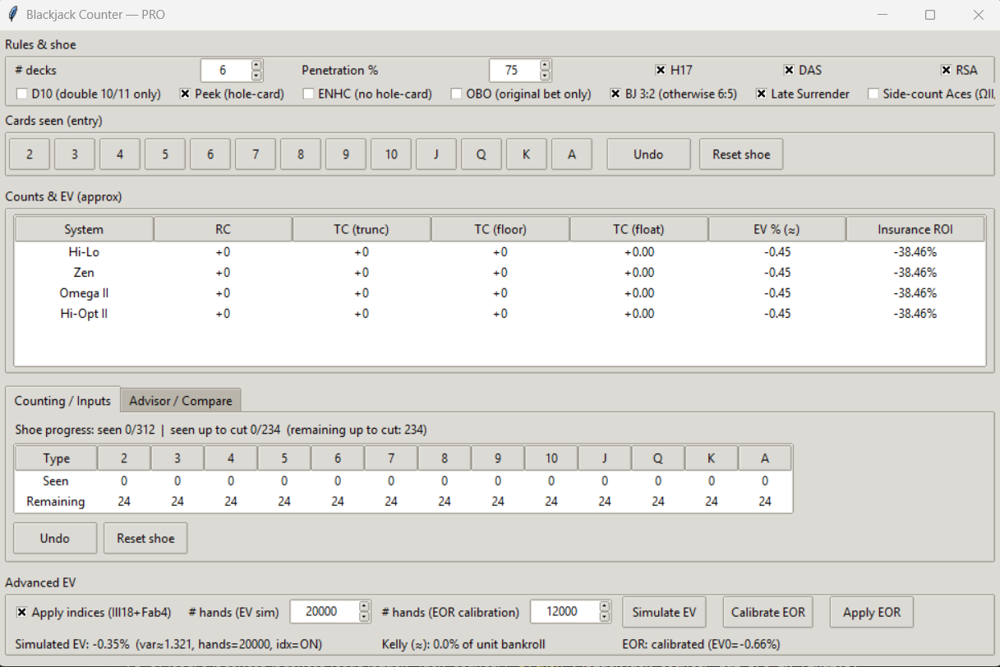
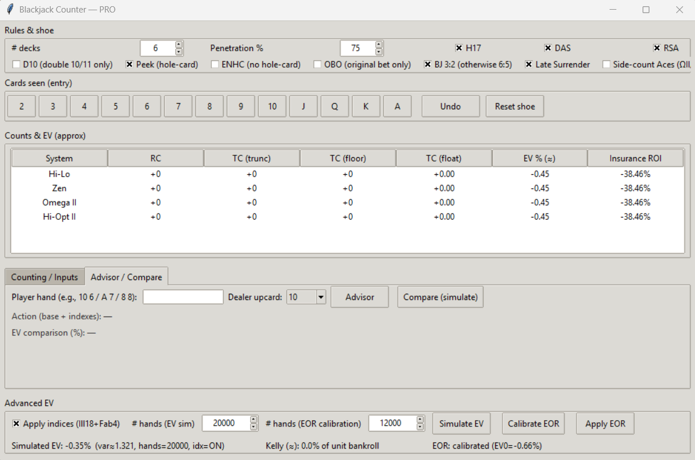

# Blackjack Counter — PRO




A desktop **Blackjack training & live assistant** written in Python/Tkinter.  
It helps you track the **running/true count**, evaluate **EV** under your exact table rules, and get **play advice** (base strategy + **Illustrious‑18/Fab‑4** indices). It can also **simulate** hands from the current shoe composition and apply a **composition‑sensitive EOR correction** to refine the displayed EV.

> **Purpose**: education & practice. Use responsibly; no guarantees of casino profit.

---

## Highlights

- Multiple counting systems: **Hi‑Lo**, **Zen**, **Omega II** (ace‑neutral), **Hi‑Opt II** (ace‑neutral).
- **Rule toggles**: S17/H17, **DAS**, **RSA**, **Hit Split Aces (HSA)**, **Double on Split Aces**, **D10** (double 10/11 only), **PEEK** vs **ENHC**, **OBO** (Original Bet Only in ENHC), **BJ 3:2 / 6:5**, **Late Surrender**.
- **Penetration** control and a true‑count denominator that uses **cards remaining up to the cut**, with a safety floor of **¼ deck** to avoid noise.
- **Advisor** (base strategy + indices) and **Compare (simulate)** that Monte‑Carlo tests **Stand/Hit/Double/Split/Surrender** for the *current composition & rules*.
- **Advanced EV** panel: Monte‑Carlo **EV & variance**, **Kelly (approx)**, and **EOR** calibration (per‑rank **Effect of Removal** vector) to refine EV by the exact card mix left.
- Fast **keyboard entry** for cards (2–9, `0/T` for ten, `J/Q/K/A`). Undo/reset included.
- Accurate **ENHC/PEEK/OBO** resolution (splits, doubles, insurance, BJ payout).

---

## Installation

No external pip dependencies — everything is standard library.

- **Windows / macOS** (Python ≥ 3.9): Tkinter ships with the official Python installers.  
- **Linux**: make sure Tk is present, e.g. on Debian/Ubuntu:
  ```bash
  sudo apt update && sudo apt install -y python3-tk
  ```

Clone/copy the repo and run:

```bash
python3 blackjack_counter_gui_pro.py
```

---

## Quick Start (2 minutes)

1. Launch the app. In **Rules & shoe**, set **# decks** and **penetration %**, then tick the rules to match your table.
2. As cards are seen, **press keys** to record them (e.g., `5`, `0` for ten, `k` for King). Use **Undo** if needed.
3. Watch the **Counts & EV** table update per system (RC, TC trunc/floor/float, EV%, Insurance ROI%).
4. Use **Advisor / Compare**:
   - Enter your hand (e.g., `10 6`, `A 7`, `8 8`) and the dealer up‑card, click **Advisor** for the play.
   - Click **Compare (simulate)** to see simulated EV for **Stand/Hit/Double/Split/Surrender**.
5. In **Advanced EV**, optionally **Simulate EV** (many hands) and **Calibrate EOR**; then click **Apply EOR** to add a composition‑sensitive delta to the linear EV shown in the main table.

---

## UI Tour

### 1) Rules & shoe
- **# decks** (1–12), **Penetration %** — used to compute *cards remaining up to the cut* for the **TC denominator**.
- **H17**: dealer hits soft 17 (on/off).
- **DAS**: double after split allowed.
- **RSA**: resplit aces allowed (up to 3 splits internally).
- **Hit Split Aces (HSA)**: if off, each split Ace receives **one card only**.
- **Double on Split Aces**: if **HSA is off**, the app still honors **“one card then count as double”** on split Aces when this toggle is on.
- **D10**: doubling restricted to totals **10 or 11**.
- **PEEK**: American hole‑card. **ENHC**: European (no hole card). These are mutually exclusive; choosing one disables the other.
- **OBO**: “original bet only” in ENHC if dealer has BJ (splits/doubles don’t lose extra).
- **BJ 3:2 / 6:5**: payout when player has natural.
- **Late Surrender** (LS).
- **Side‑count Aces** (for Omega II / Hi‑Opt II): if you **don’t** side‑count aces, the slope used for these systems is penalized internally, reflecting the weaker betting correlation.

### 2) Counting / Inputs (tab)
- Grid shows **Seen** and **Remaining** cards by rank, plus **Shoe progress** (`seen / total`, and `remaining up to cut`).
- **Buttons/keys** to add cards; **Undo** and **Reset shoe** are available.

### 3) Advisor / Compare (tab)
- **Hand entry** accepts `10 6`, `A 7`, `8 8` (commas and slashes are okay, e.g. `A,7`).  
- **Advisor** returns base strategy **plus indices** using **TC floor** (Illustrious‑18 + Fab‑4 and common negatives like 12v4/5/6, 13v2/3, etc.).  
- **Compare (simulate)** runs a Monte‑Carlo from the **current composition** and prints EV% for: **Stand / Hit / Double / Split / Surrender** under your rules. Great to verify tricky spots or house rule changes.

### 4) Counts & EV (approx) table
One row per counting system showing:
- **RC** (running count)
- **TC (trunc)** — truncated true count (common for betting ramps)
- **TC (floor)** — floored true count (used for indices)
- **TC (float)** — exact true count
- **EV %** — **linear model** `base_edge + slope × TC_floor`, optionally **plus EOR correction** (see below)
- **Insurance %** — ROI of insurance if an Ace is up: `EV = 2p − 1` where *p* is the 10‑density in the remaining shoe

### 5) Advanced EV
- **Apply indices (Ill18+Fab4)**: include indices in simulations and advice.
- **# hands (EV sim)**: number of trials for **Simulate EV** (mean & variance → **Kelly (approx)** as `edge/var`, clipped to [0,1]).
- **# hands (EOR calibration)**: trials used to compute an **EOR vector** (per‑rank EV deltas when removing one card).  
  After calibrating, **Apply EOR** injects a composition‑sensitive delta into the table’s EV. This improves the linear EV around your current shoe.

---

## Counting Systems & Indices

- **Hi‑Lo**, **Zen**, **Omega II**, **Hi‑Opt II** are all supported.  
- **Ace side‑count** toggle affects **Omega II** and **Hi‑Opt II** betting slopes (penalty if not used).  
- **Indices**: Illustrious‑18 + Fab‑4 (multi‑deck approximations, **TC floor**). Includes classic negatives (e.g., 12v4/5/6, 13v2/3) and a few extras (e.g., 12v7 at +3).

---

## How accuracy is computed

### Linear EV model
`EV ≈ base_edge + slope × TC_floor`  
- `base_edge` depends on decks and rules (S17/H17, DAS, LS, ENHC/PEEK, etc.).  
- `slope` depends on the counting system and decks; **Omega II/Hi‑Opt II** slopes are reduced when ace side‑count is disabled.

### EOR correction (optional, local to your shoe)
1. **Calibrate EOR**: simulate EV at the current shoe, then remove one card of each rank to measure **ΔEV** per rank.  
2. **Apply EOR**: compare the current card mix to the reference and add `Σ ΔEV(rank) × (ref_count − cur_count)` to the displayed EV.

### Insurance EV
If the dealer shows **A**, insurance ROI is `EV = 2p − 1` where *p* is the fraction of **{10,J,Q,K}** left.

### True Count denominator
Uses **cards remaining up to the cut** (penetration). To stabilize TC at deep penetration, a minimum denominator of **¼ deck** is enforced.

---

## Keyboard Shortcuts

- `2–9` add that rank.  
- `0`, `t`, `T` add **Ten**.  
- `j/J`, `q/Q`, `k/K`, `a/A` add **J/Q/K/A**.  
- **Focus‑aware**: typing inside inputs does not add cards.  
- Use **Undo** or **Reset** from the UI to correct entries.

---

## Developer Guide

### Code layout (single file)

- `apply_indices_override(total, soft, up, first_two, can_double, tc_floor, rules)` – returns `'D'/'S'/'H'/'SUR'/None` per Ill18/Fab4 + extras.
- `hand_total(cards)` – best total with Ace soft/hard detection.
- `is_blackjack(cards)` – natural check.
- `copy_counts(rem)` – shallow copy of remaining‑card dict.
- `draw_one(counts, rnd)` – draw a random card by remaining counts.
- `should_split(rank, up, rules)` – pair‑splitting matrix, honoring **DAS/RSA** and **HSA/DOS** for Aces.
- `hard_action(...)`, `soft_action(...)` – **base strategy** given rules and “D10” restriction.
- `estimate_base_edge(...)` – base house/player edge from rules and decks.
- `slope_for(system, decks, side_ace_used)` – betting slope per system/decks (with ace‑side‑count penalty for ΩII/Hi‑Opt II when disabled).
- `dealer_play(cards, counts, rules, rnd)` – dealer AI (S17/H17).
- `resolve_vs_dealer(...)`, `resolve_vs_dealer_stand(...)` – **exact payout** resolution including **ENHC + OBO**.
- `play_hand(...)` – full player game tree (split up to 3 times, **LS**, **DAS**, **HSA/DOS** logic).  
  *Edge case handled*: when **HSA = off** and **Double on Split Aces = on**, split Aces receive one card and are resolved as a **double**.
- `play_hand_forced_first(...)` – like `play_hand` but forces the first decision; used by **Compare (simulate)**.
- `simulate_one_hand(...)`, `simulate_ev(...)` – Monte‑Carlo engine (mean EV% and variance).
- `calibrate_eor(...)` – compute **EOR** vector versus the current composition.
- `simulate_fixed_action(...)` – simulate EV of a specific action (Stand/Hit/Double/Split/Surrender).
- **GUI (Tkinter)**: class `ProApp` with builders: `_build_controls`, `_build_table`, `_build_mid_notebook`, `_build_ev_panel`, `_build_status`; and helpers: `remaining_counts`, `add_card`, `undo`, `reset_shoe`, `decks_remaining`, `shoe_progress`, `tc_values`, `insurance_ev_comp`, `update_all`, `advise_btn`, `compare_btn`, `calibrate_eor_btn`, `ev_eor_btn`.

> The app keeps all state in memory; no files or network calls are made.

---

## Tips & Best Practices

- Prefer **TC floor** for index plays; use **TC trunc** for betting ramps (common convention).
- For **Omega II / Hi‑Opt II**, enable **Ace side‑count** for stronger betting correlation (or accept the internal slope penalty).
- When penetration gets deep, consider **simulating** or **calibrating EOR** — linear EV alone is less precise near the cut.
- For **ENHC** tables, toggling **OBO** changes split/double loss versus dealer BJ; use **Compare** to see the impact.
- **Insurance** is good when **Hi‑Lo TC ≥ +3** (rule of thumb) or whenever insurance ROI shows **positive** here.

---

## Troubleshooting

- **GUI doesn’t open (Linux)**: install Tk (`python3-tk`).  
- **Keys don’t add cards**: click outside the text inputs; the app ignores keystrokes when a field has focus.  
- **Large EV variance**: increase the number of hands in **Simulate EV**.  
- **Weird TC late in the shoe**: that’s normal—denominator is small. A ¼‑deck floor keeps it usable but expect higher volatility.

---

## Repository Layout

```
.
├── blackjack_counter_gui_pro.py
└── screen/
    ├── Screenshot1.png
    └── Screenshot2.png
```

---

## Disclaimer

This tool is for **training and analytics**. Blackjack outcomes involve variance and casino rules may differ. **No warranty**; use at your own risk. Practice responsible bankroll management.

---

## Contributing

PRs and issues are welcome. If you spot an edge‑case (rule set, index threshold, payout) that could be modeled better, open an issue with details.

